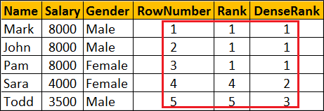

# SQL Pagilla Database

### Creating Pagilia Database
***
* First, open up Postgres by typing psql into Command Line
* Next, run the sql files inside the pagilia folder. Type the following in order
	1. \i pagilia-schema.sql
	2. \i pagilia-data.sql
	3. \i pagilia-insert-data.sql

### Creating SQL Queries to answer Questions concerning Pagilia Database
***
##### Questions and Queries
***
* 1a. You need a list of all the actors’ first name and last name.
```sql
SELECT first_name, last_name
FROM actor; 
```

* 1b. Display the first and last name of each actor in a single column in upper case letters. Name the column Actor Name.
```sql
SELECT UPPER(CONCAT(first_name, ' ', last_name))
AS "ACTOR NAME"
FROM actor;
```

* 2a. You need to find the id, first name, and last name of an actor, of whom you know only the first name of "Joe." What is one query would you use to obtain this information?
```sql
SELECT actor_id, first_name, last_name
FROM actor
WHERE first_name = 'JOE';
```

* 2b. Find all actors whose last name contain the letters GEN. Make this case insensitive
```sql
SELECT actor_id, first_name, last_name
FROM actor
WHERE last_name iLIKE '%GEN%';
```

* 2c. Find all actors whose last names contain the letters LI. This time, order the rows by last name and first name, in that order. Make this case insensitive.
```sql
SELECT actor_id, first_name, last_name
FROM actor
WHERE last_name iLIKE '%LI%'
ORDER BY last_name, first_name;
```

* 2d. Using IN, display the country_id and country columns of the following countries: Afghanistan, Bangladesh, and China:
```sql
SELECT country_id, country
FROM country
WHERE country IN ('Afghanistan', 'Bangladesh', 'China');
```

* 3a. Add a middle_name column to the table actor. Specify the appropriate column type
```sql
ALTER TABLE actor ADD COLUMN middle_name VARCHAR(25);
```

* 3b. You realize that some of these actors have tremendously long last names. Change the data type of the middle_name column to something that can hold more than varchar.
```sql
ALTER TABLE actor ALTER COLUMN middle_name TYPE text;
```

* 3c. Now write a query that would remove the middle_name column.
```sql
ALTER TABLE actor DROP COLUMN middle_name;
```

* 4a. List the last names of actors, as well as how many actors have that last name.
```sql
SELECT last_name, COUNT(last_name)
FROM actor
GROUP BY last_name;
```

* 4b. List last names of actors and the number of actors who have that last name, but only for names that are shared by at least two actors
```sql
SELECT last_name, COUNT(last_name)
FROM actor
GROUP BY last_name
HAVING COUNT(last_name) > 1;
```

* 4c. Oh, no! The actor HARPO WILLIAMS was accidentally entered in the actor table as GROUCHO WILLIAMS. Write a query to fix the record.
```sql
UPDATE actor
SET first_name = 'HARPO', last_name = 'WILLIAMS'
WHERE first_name = 'GROUCHO' AND last_name = 'WILLIAMS';
```

* 4d. Perhaps we were too hasty in changing GROUCHO to HARPO. It turns out that GROUCHO was the correct name after all! 
```sql
UPDATE actor
SET first_name = (
CASE
WHEN first_name iLike 'HARPO' AND last_name = 'WILLIAMS'
THEN 'GROUCHO'
WHEN first_name iLike 'GROUCHO' AND last_name = 'WILLIAMS'
THEN 'MUCHO GROUCHO'
ELSE first_name
END);
```

* 5a. 
	* What’s the difference between a left join and a right join.
		The difference between a left join and a right join is that a left join will create join the 2 tables on the table on the left of the join statement and will include all the values from the left table regardless of whether those values exist in the right table and vice versa for a right join. Refer to the table below for a better understanding.

	* What about an inner join and an outer join?
		The difference between an inner and outer join is that an inner join would only include values that exists in both tables. On the other hand, the outer join would include all the values in both tables regarless of if there is an overlap. Refer to the table below for a better understanding.


* 5a.

	* When would you use rank?
		You would use rank when you want to count the rows, but you have duplicate values. Rows with the same values would be assigned the same rank value. However, there is a gap between ranks.

	* What about dense_rank?
		You would use dense_rank when you want to count the rows, but you have duplicate values. Rows with the same values would be assigned the same rank value. However unlike rank, there is no gap between different dense_ranks.



* 5a.

	* When would you use a subquery in a select?
		You would use a subquery in a select when you know what to look for using a SELECT but don't know which exact value.

	* When would you use a right join?
		You would use a right join when you are interested in the values that only exists in the right table.

	* When would you use an inner join over an outer join?
		You would use an inner join over an outer join when you only want values that appear in both tables and not all the values in both tables.

	* What’s the difference between a left outer and a left join
		There is NO difference between a left outer and a left join.

	* When would you use a group by?
		You would use a group by when you have an aggregate statement such as COUNT, SUM, AVG, etc.

	* Describe how you would do data reformatting
		You would do data reformatting by using the FORMAT function.

	* When would you use a with clause?
		You would use a with clause to assign a name to a subquery

	* Bonus: When would you use a self join?
		You would use a self join when you want to compare values from the same column in the same table.

* 6a. Use a JOIN to display the first and last names, as well as the address, of each staff member. Use the tables staff and address:
```sql
SELECT s.first_name, s.last_name, a.address
FROM staff s
JOIN address a
ON s.address_id = a.address_id;
```

* 6b. Use a JOIN to display the total amount rung up by each staff member in January of 2007. Use tables staff and payment.
```sql
SELECT s.first_name, s.last_name, SUM(p.amount)
FROM staff s
JOIN payment p
ON s.staff_id = p.staff_id
GROUP BY s.first_name, s.last_name, p.staff_id;
```

* 6c. List each film and the number of actors who are listed for that film. Use tables film_actor and film. Use inner join.
```sql
SELECT f.title, COUNT(fa.actor_id) AS Num_of_Actor
FROM film f
INNER JOIN film_actor fa
ON f.film_id = fa.film_id
GROUP BY f.title, fa.film_id;
```

* 6d. How many copies of the film Hunchback Impossible exist in the inventory system?
```sql
SELECT f.title, COUNT(i.film_id) AS Num_of_Hunchback
FROM film f
RIGHT JOIN inventory i
ON f.film_id = i.film_id
WHERE f.title iLIKE 'Hunchback Impossible'
GROUP BY f.title, i.film_id;
```

* 6e. Using the tables payment and customer and the JOIN command, list the total paid by each customer. List the customers alphabetically by last name:
```sql
SELECT c.first_name, c.last_name, SUM(p.amount)
FROM customer c
RIGHT JOIN payment p
ON c.customer_id = p.customer_id
GROUP BY c.first_name, c.last_name, p.customer_id
ORDER BY c.last_name;
```

* 7a. The music of Queen and Kris Kristofferson have seen an unlikely resurgence. As an unintended consequence, films starting with the letters K and Q have also soared in popularity. display the titles of movies starting with the letters K and Q whose language is English.
```sql
SELECT f.title
FROM film f
JOIN language l
ON f.language_id = l.language_id
WHERE f.title iLIKE 'K%' AND l.language_id = 1 
OR f.title iLIKE 'Q%' AND l.language_id = 1;
```

* 7b. Use subqueries to display all actors who appear in the film Alone Trip.
```sql
SELECT AT.first_name, AT.last_name
FROM
(SELECT f.title, a.first_name, a.last_name
FROM film f
RIGHT JOIN film_actor fa
ON f.film_id = fa.film_id
JOIN actor a
ON fa.actor_id = a.actor_id) AT
WHERE AT.title iLIKE 'Alone Trip';
```

* 7c. You want to run an email marketing campaign in Canada, for which you will need the names and email addresses of all Canadian customers. Use joins to retrieve this information.
```sql
SELECT cu.first_name, cu.last_name, cu.email
FROM customer cu
JOIN address a
ON cu.address_id = a.address_id
JOIN city c
ON a.city_id = c.city_id
JOIN country co
ON co.country_id = c.country_id
WHERE co.country iLIKE 'Canada';
```

* 7d. Sales have been lagging among young families, and you wish to target all family movies for a promotion. Identify all movies categorized as a family film.
```sql
SELECT f.title
FROM film f
JOIN film_category fc
ON f.film_id = fc.film_id
JOIN category c
ON fc.category_id = c.category_id
WHERE c.name iLIKE 'Family';
```

* 7e. Display the most frequently rented movies in descending order.
```sql
SELECT f.title, COUNT(r.rental_id)
FROM film f
JOIN inventory i
ON f.film_id = i.film_id
JOIN rental r
ON i.inventory_id = r.inventory_id
GROUP BY f.title
ORDER BY COUNT(r.rental_id) DESC;
```

* 7f. Write a query to display how much business, in dollars, each store brought in.
```sql
SELECT s.store_id, SUM(p.amount)
FROM payment p
JOIN staff stf
ON p.staff_id = stf.staff_id
JOIN store s
ON s.store_id = stf.store_id
GROUP BY s.store_id;
```

* 7g. Write a query to display for each store its store ID, city, and country.
```sql
SELECT s.store_id, c.city, co.country
FROM staff s
JOIN address a
ON s.address_id = a.address_id
JOIN city c
ON a.city_id = c.city_id
JOIN country co
ON co.country_id = c.country_id;
```

* 7h. List the top five genres in gross revenue in descending order. 
```sql
SELECT c.name, SUM(p.amount)
FROM payment p
JOIN rental r
ON p.rental_id = r.rental_id
JOIN inventory i 
ON r.inventory_id = i.inventory_id
JOIN film_category fc
ON fc.film_id = i.film_id
JOIN category c
ON fc.category_id = c.category_id
GROUP BY c.name, c.category_id
ORDER BY SUM(p.amount) DESC
LIMIT 5;
```

* 8a. In your new role as an executive, you would like to have an easy way of viewing the Top five genres by gross revenue. Use the solution from the problem above to create a view. 
```sql
CREATE OR REPLACE VIEW top_5_gross_genre AS
SELECT c.name, SUM(p.amount)
FROM payment p
JOIN rental r
ON p.rental_id = r.rental_id
JOIN inventory i 
ON r.inventory_id = i.inventory_id
JOIN film_category fc
ON fc.film_id = i.film_id
JOIN category c
ON fc.category_id = c.category_id
GROUP BY c.name, c.category_id
ORDER BY SUM(p.amount) DESC
LIMIT 5;
```

* 8b. How would you display the view that you created in 8a?
```sql
SELECT *
FROM top_5_gross_genre;
```

* 8c. You find that you no longer need the view top_five_genres. Write a query to delete it.
```sql
DROP VIEW top_5_gross_genre;
```

### Appendix: List of Tables in the Pagilla DB
***
'actor'
'actor_info'
'address'
'category'
'city'
'country'
'customer'
'customer_list'
'film'
'film_actor'
'film_category'
'film_list'
'film_text'
'inventory'
'language'
'nicer_but_slower_film_list'
'payment'
'rental'
'sales_by_film_category'
'sales_by_store'
'staff'
'staff_list'
'store'

##### Contributors
***
Jonathan Lee [GitHub](https://github.com/jonyclee)

##### Technologies Used:
***
* SQL (Postgres)
* Navicat Lite